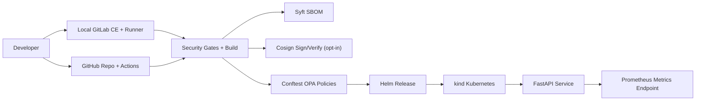
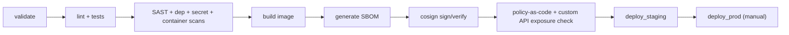

# secure-ci-cd-supply-chain-platform

Portfolio-grade, local-first secure software delivery lab for a Staff DevSecOps Engineer narrative.

This repo demonstrates secure CI/CD supply-chain controls with both **self-hosted GitLab CI** and **GitHub Actions**:

- SAST (Bandit, Semgrep)
- Dependency scanning (pip-audit, npm audit)
- Secret scanning (Gitleaks)
- Container scanning (Trivy)
- SBOM generation (Syft)
- Image signing/verification (Cosign, opt-in)
- Policy-as-code gates (OPA/Conftest)
- Deployment to Kubernetes/Helm only after security gates pass

No paid cloud required and safe for public publishing (fake placeholders only).

## Why this matters for DevSecOps roles

It proves practical supply-chain ownership: secure-by-default app design, deterministic security gates, policy enforcement, and controlled release workflows across GitLab + GitHub ecosystems.

## Architecture Diagram



## Secure Pipeline Diagram



## Local Setup

```bash
cp .env.example .env
make prereqs
make install
make test
```

Run backend locally:

```bash
docker compose -f docker/docker-compose.yml up -d --build
curl http://localhost:8001/health
```

## Run Security Controls Locally

```bash
make sast
make dep-scan
make secret-scan
make docker-build
make container-scan
make sbom
make policy
python security/api_exposure_check.py
```

Run full local security bundle:

```bash
make security-all
```

## SBOM, Signing, Verification

```bash
make sbom
COSIGN_ENABLE=true make sign-image
COSIGN_ENABLE=true make verify-image
```

## Deploy to kind with Helm

```bash
make kind-create
make helm-deploy-staging
```

Prod-style deploy:

```bash
make helm-deploy-prod
```

## Integrate with Local Self-Hosted GitLab

Use [docs/local-gitlab-integration.md](docs/local-gitlab-integration.md).

Key CI variables for local GitLab project:

- `KUBECONFIG_B64`
- optional registry vars (`CI_REGISTRY`, `CI_REGISTRY_USER`, `CI_REGISTRY_PASSWORD`)
- optional `COSIGN_ENABLE=true`

## GitHub Actions

Workflow file: `.github/workflows/secure-supply-chain.yml`.

Use [docs/github-actions.md](docs/github-actions.md) for GHCR and signing notes.

## Threat Model and Runbooks

- [docs/threat-model.md](docs/threat-model.md)
- [docs/security-controls.md](docs/security-controls.md)
- [docs/remediation-guide.md](docs/remediation-guide.md)
- [docs/incident-runbook.md](docs/incident-runbook.md)
- [docs/screenshots-checklist.md](docs/screenshots-checklist.md)
- [docs/resume-bullets.md](docs/resume-bullets.md)

## Public Safety

- No real secrets or customer data.
- No real Stripe keys; payment flow is mocked.
- Vulnerable examples are isolated in `vulnerable-demo/` for controlled scanner demos.
